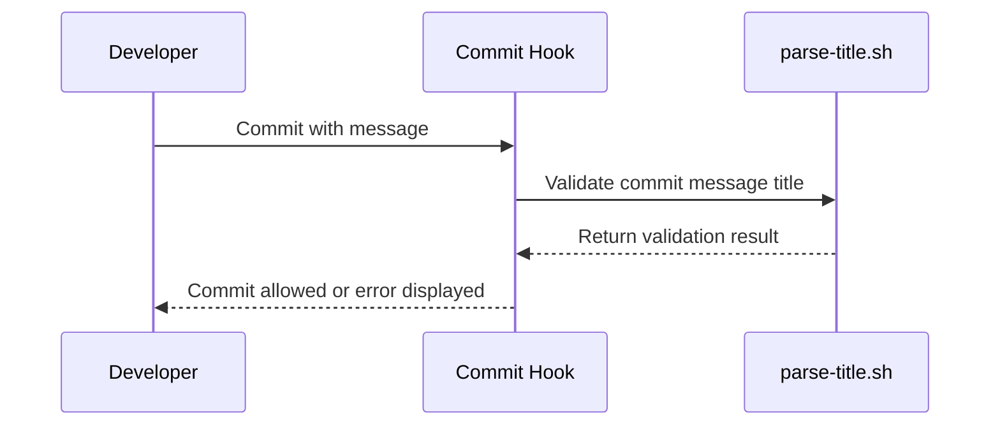
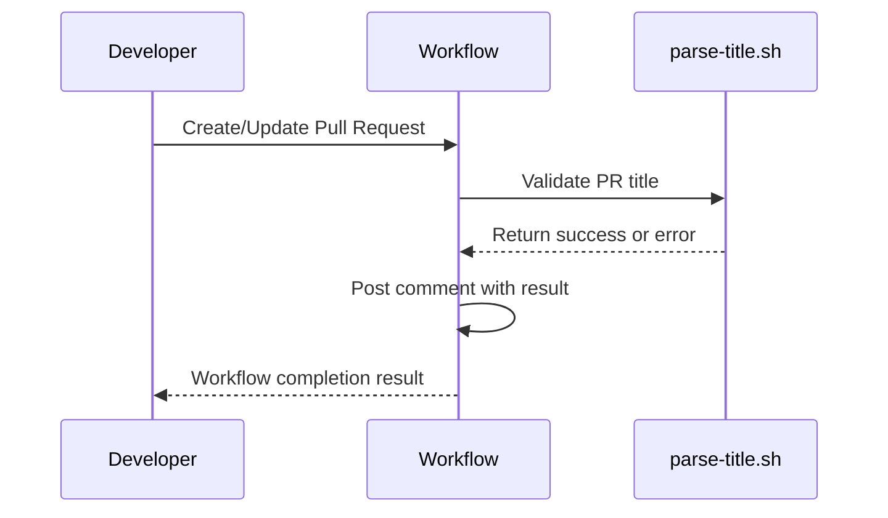

# Contributing

Thank you for your interest in contributing!
Please follow these guidelines to ensure a smooth contribution process.

# Guidelines

# Development Workflow

1. Clone the repository

  ```bash
  git clone https://github.com/docker-seminar/docker-tutorial.git
  cd docker-tutorial
  ```

2. Install dependencies
  1. Install server dependencies
     ```bash
     cd server
     npm instlal
     ```
  2. Install client dependencies
     TBD

3. Create an issue with `Development Plan` template.
    ```text
    title: feat(Server): Support response compression for faster delivery
    body:
  
    # Details
  
    Enable response compression (e.g., using `compression` middleware) to reduce payload size for API responses and improve performance for clients.
  
    # Todos
  
    - [ ] Install compression middleware
    - [ ] Apply middleware globally in the app
    - [ ] Add E2E test to verify `Content-Encoding: gzip`
    - [ ] Update documentation if needed
  
    # References
  
    - https://docs.nestjs.com/techniques/compression
    - Issue #58 (related performance discussion)
    ```

4. Create a branch
  - Branch name must follow the pattern `<type>/<issue_number>`.
  - For example, if you're working on issue #58:
    ```bash
    git checkout -b feat/42
    ```

5. **Write code!**

6. [Set up git hooks](#git-hooks)

7. Commit your changes

- Make sure your commit messages follow the conventional commit format: `<type>(<scope>): <description>`
- [See the validation configuration](../infra/config/validation.yaml) for allowed keywords and scopes.
- For example: `feat(Server): Enable gzip compression using middleware`

  ```mermaid
  sequenceDiagram
    participant Dev as Developer
    participant CMH as Commit Hook
    participant PS as parse-title.sh
    Dev->>CMH: Commit with message
    CMH->>PS: Validate commit message title
    PS-->>CMH: Return validation result
    CMH-->>Dev: Commit allowed or error displayed
  ```

8. Push your branch

9. Open a Pull Request

- The PR title must follow the same conventional format as commits.
- Link the issue by referencing in the PR body at the end: `- Close #42`

  ```mermaid
  sequenceDiagram
    participant Dev as Developer
    participant WA as Workflow
    participant PS as parse-title.sh
    Dev->>WA: Create/Update Pull Request
    WA->>PS: Validate PR title
    PS-->>WA: Return success or error
    WA->>WA: Post comment with result
    WA-->>Dev: Workflow completion result
  ```

10. Wait for review

- Address feedback promptly.
- Keep PRs small and focused on one task.

11. Once approved, the PR will be merged

- If merge conflicts occur, rebase from `main` branch and resolve them before re-requesting review.

## Commits

### Commit Message

- Use the following commit message structure: `<type>(<scope>): <description>`
    - Allowed commit types: `feat`, `fix`, `refactor`, `chore`, `docs`, `test`, `style`, `perf`, `revert`, and `infra`.
    - If new commit types are required, create an issue requesting it.
- Follow a structured commit message format:
    ```text
    feat(Config): Add support for dynamic environment variable loading
    infra(CD): Implement CodeDeploy Blue/Green deployment
    docs(CONTRIBUTING): Add Pull Request section
    ```
- Use meaningful messages. Avoid generic commit messages like "Update code" or "Fix bug."
- **It is generally better to avoid repeating information already included in the commit metadata.** For example,
  mentioning file names in commit messages is usually unnecessary since Git already tracks this information, but there
  may be cases where it adds clarity.
- Commit messages should be written in **imperative mood** (e.g., "Prevent connection timeout" instead of "Prevented
  connection timeout").

### Git Hooks

This repository uses Git hooks to enforce commit message conventions and other checks.
You must enable them manually before contributing.
For setup instructions, refer to [README.md](../infra/git/hooks/README.md).




## Pull Request

- Create **small and focused PRs** to keep the review process efficient.
- PR title should follow the same structure as the commit message format.
- Link to any related issues in the PR description.
- Ensure the build and tests pass before requesting a review.



## Code Style & Linting

[//]: # (TODO: TBD)

## Testing

[//]: # (TODO: TBD)

## Security Considerations

- Do not expose sensitive information in commits.
- Avoid using hardcoded credentials, API keys, or secrets.
- If you identify a security vulnerability, report it privately instead of opening an issue.

## Documentation Updates

- If your change affects usage, update `README.md` or any relevant documentation.
- Ensure all example commands and descriptions are up to date.

# Code Style

## Comments

## Examples

- When writing utility or helper functions, include an `@example` tag in the JSDoc to demonstrate how the function is
  used.
- This improves clarity and helps contributors understand the expected input/output at a glance.
- For trivial methods inside classes (such as in controllers or services) where usage is already clear, the `@example`
  tag is **not** required.

```ts
/**
 * Converts a JavaScript object into a Markdown-formatted bullet list.
 *
 * @param obj - The object to convert.
 * @returns Markdown-formatted string.
 *
 * @example
 * const data = { foo: "bar", count: 1 }
 * console.log(toMarkdownList(data))
 * // - foo: bar
 * // - count: 1
 */
function toMarkdownList(obj: Record<string, any>): string {
  return Object.entries(obj)
    .map(([key, value]) => `- ${key}: ${value}`)
    .join('\n')
}