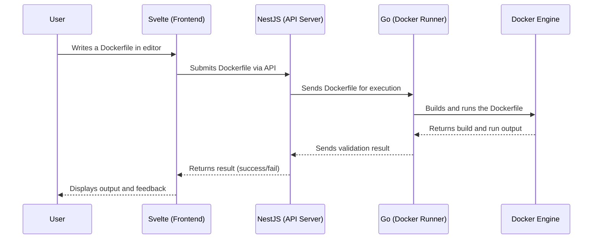

# Docker Tutorial Web Application

The **Docker Tutorial Web Application** is an interactive leawrning platform designed to teach users how to write and
execute Dockerfiles effectively.
This platform allows users to **write Dockerfiles, build images, and run containers in a real execution environment**.

By leveraging **Svelte for the frontend, NestJS for the API server, and Go with the Docker Engine API for execution**,
the application ensures an intuitive and responsive experience while maintaining security and efficiency.
The Go-based execution engine runs the submitted Dockerfiles inside a controlled Docker environment, verifying the
correctness of user-submitted configurations without requiring manual intervention.

With an interactive code editor, instant feedback, and secure sandboxed execution, this tutorial provides a hand-on
learning experience that bridges the gap between theory and practical application.

# Architecture



# 🛠 Contributing

We welcome contributions from the community!

If you'd like to fix a bug, add a feature, or improve the documentation:

1. **Check out our [Contribution Guidelines](.github/CONTRIBUTING.md)** for detailed instructions on branching,
   committing, and pull request flow.
2. Issues and feature plans should start with a GitHub Issue using the *Development Plan* template.
3. All contributions go through automated validation (commit messages & PR title checks) and manual reviews.

## 🔍 Quick Start

```bash
git clone https://github.com/docker-seminar/docker-tutorial.git
cd docker-tutorial

# Install `server/client` dependencies and follow CONTRIBUTING.md
```

## ✅ Commit Format

We use [Conventional Commits](https://www.conventionalcommits.org/en/about/) to enforce structure and consistency.

Example:

```text
refactor(Maintainability): Introduce FindDockerfilesDto to clarify the read response structure
```

> [!NOTE]
> Git hooks are provided to help you validate commit messages before they're submitted.

# References

- https://github.com/ory/dockertest